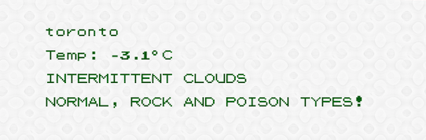
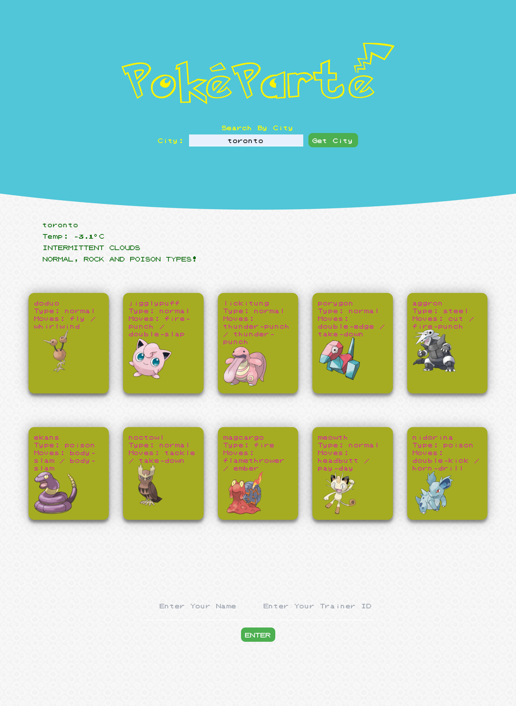
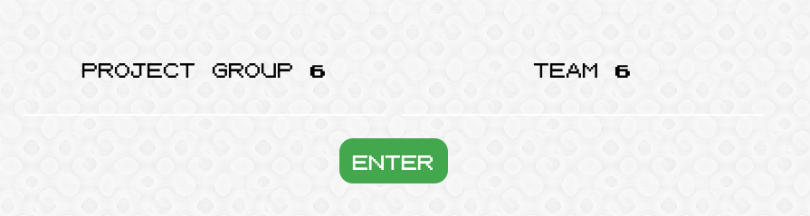
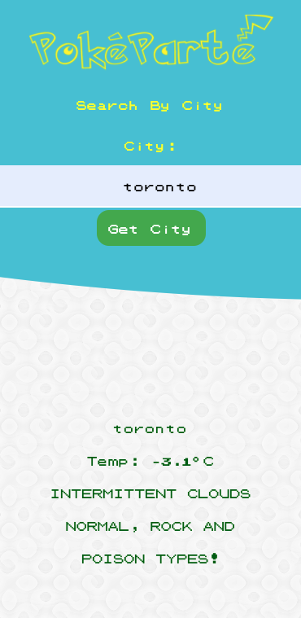
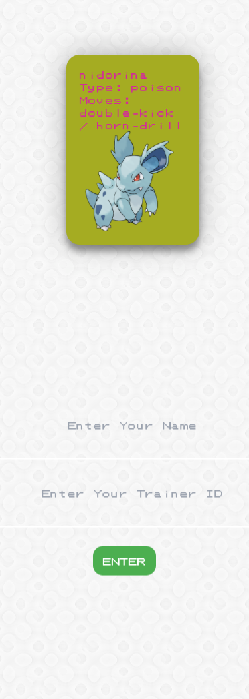
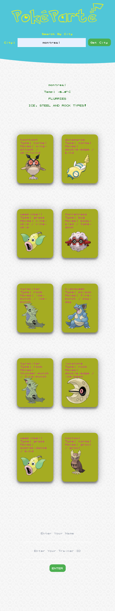
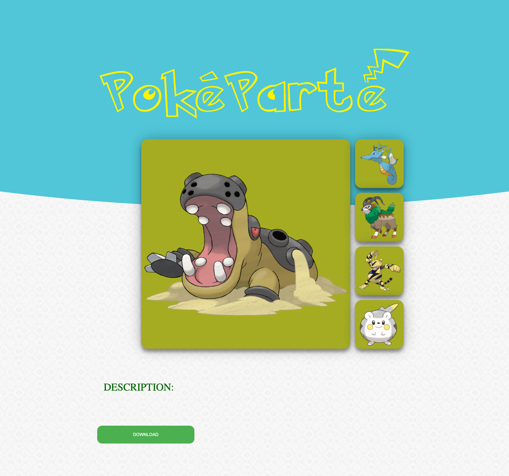

# Poke-Parte!

Please visit our completed webpage at:  https://damn-ma-6.github.io/Poke-Parte/

Hello, and welcome to our README! This is for our first group project. We were tasked with creating an application that provided a service, while combining two different server side APIs. We had some trials and tribulations throughout the making of this project, but we all learned a lot and ended up creating a really fun and unique project. 

PokéParté is a website that creates a roster of Pokémon based on your location and the current weather data. Pokémon have unique skills based on their “type” and have higher attacks in certain weather conditions. A Pokémon player would find it interesting and fun to see what kind of Pokémon they could catch near them if they existed in real life.

It was our job to ensure PokeParte met the following criteria: 

    -use a CSS framework other than Bootstrap 
        + we used Tailwind.css 🍃 

    - deploy to GitHub Pages 
        + but you already knew that 😺

    - be interactive
        + our application accepts input from the user in the form of a city, a name and a Trainer ID 😁

    - use at least two server-side APIs
        + we used PokeApi and AccuWeather 🌡️

    -use client-side storage to store persistent data
        + the Pokemon chosen, city name, user name and Trainer ID are all saved in localStorage to be accessed on the second page of the application 💾

    -be reponsive
        + we used media-queries to ensure our project looks good on all screen sizes 📱

    -have a polished UI
        + out interface is easy to use and succint 💁

    -have a clean repository that meets quality coding standards

    - have a quality README
        + well, what do you think?😉

 

We were to create this application, and meet all of the requirements listed above, by using: 

	- HTML
    - CSS 
    - JavaScript
    - Web APIs
    - Third Party APIs - jQuery, Tailwind
    - Server Side APIs - PokeApi, AccuWeather
	
Features: 

* [Installation](#installation)
* [Usage](#usage)
* [Credits](#credits)
* [Learning](#learning)
* [License](#license)

## Installation

There is no installation required. This application can be run on any web browser. 

## Usage

<<<<<<< HEAD

=======

>>>>>>> e78d76709f6022332ca34fced27332b948c1eb05

Here are some user experience highlights from our application: 
    
    - when the user searches for a city, they are shown data for that city. 
        + the current temperature
        + the weather conditions 
        + a list of Pokemon types

<<<<<<< HEAD

    - a random assortment of 10 Pokemon are displayed on cards that match the types returned from the weather condition

=======

    - a random assortment of 10 Pokemon are displayed on cards that match the types returned from the weather condition

>>>>>>> e78d76709f6022332ca34fced27332b948c1eb05

    - the user selects 5 out of the 10 Pokemon to add to their team. 

    - the user enters their Name and Trainer ID from PokemonGo (optional)

<<<<<<< HEAD

     - mobile and desktop screen sizes

    - once the user clicks the "Enter" button, they are brought to a seperate page which has their 5 chosen Pokemon, their city name, name, and optional Trainer ID. The user has the option to save this roster as a jpeg and post wherever they would like. 

=======

    - once the user clicks the "Enter" button, they are brought to a seperate page which has their 5 chosen Pokemon, their city name, name, and optional Trainer ID. The user has the option to save this roster as a jpeg and post wherever they would like. 

>>>>>>> e78d76709f6022332ca34fced27332b948c1eb05

## Credits
Here are the sources we used: 

- [PokeApi](https://pokeapi.co/)

- [AccuWeather](https://developer.accuweather.com/)

- [Pokemon Images](https://pokeres.bastionbot.org/)

- [jQuery](https://jquery.com/)

- [Tailwind](https://tailwindcss.com/)

- [Trello](https://trello.com/b/jNHuFmmb/pok%C3%A9project)

## Learning
Here are the highlights of what we learned and issues we had while writing this code:

1. The first major issue we ran into was having the cards display different Pokemon. Everytime the application ran, the cards were cycling through the Pokemon all at the same time. With the help of our teaching assistant, Edward(🙏🏼), we were able to figure out that we were running a for loop when we didn't have to. We were also using array indexes improperly. 

2. Our communication was really great during this project. Slack, Trello and Zoom calls kept us organized and up to date with eachother. Using pull requests on GitHub and having others review the code helped us catch errors and issues we may have missed any other way. 

3. We all had skills that we brought into this project that made working together easy and fun. 

4. It took us some time to get the styling working correctly for all of us, but once we updated all of our files so we were working with the same classes and ids everything came together. 

Our wireframe: 

## License

MIT License

Copyright (c) 2021 damn-ma-6 

Permission is hereby granted, free of charge, to any person obtaining a copy
of this software and associated documentation files (the "Software"), to deal
in the Software without restriction, including without limitation the rights
to use, copy, modify, merge, publish, distribute, sublicense, and/or sell
copies of the Software, and to permit persons to whom the Software is
furnished to do so, subject to the following conditions:

The above copyright notice and this permission notice shall be included in all
copies or substantial portions of the Software.

THE SOFTWARE IS PROVIDED "AS IS", WITHOUT WARRANTY OF ANY KIND, EXPRESS OR
IMPLIED, INCLUDING BUT NOT LIMITED TO THE WARRANTIES OF MERCHANTABILITY,
FITNESS FOR A PARTICULAR PURPOSE AND NONINFRINGEMENT. IN NO EVENT SHALL THE
AUTHORS OR COPYRIGHT HOLDERS BE LIABLE FOR ANY CLAIM, DAMAGES OR OTHER
LIABILITY, WHETHER IN AN ACTION OF CONTRACT, TORT OR OTHERWISE, ARISING FROM,
OUT OF OR IN CONNECTION WITH THE SOFTWARE OR THE USE OR OTHER DEALINGS IN THE
SOFTWARE.